# Projects

## Featured Projects

### TSO OperatorNext (2025.03 - now)

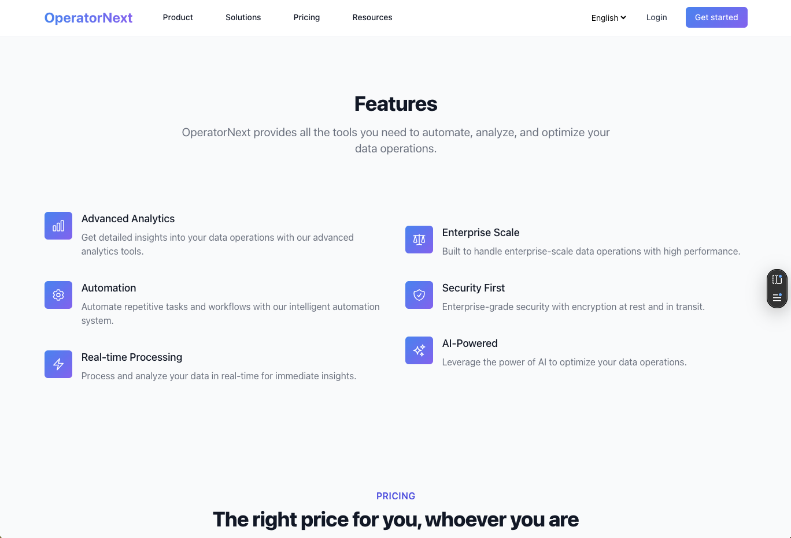

TSO is a AI assistant that helps companies to address their business needs, including internal knowldge management, customer support, and sales assistance.

Related projects:

- [Chat ERP](https://github.com/dotku/chaterp)
- [AI Business](https://ai-business.jytech.us/)

### Job Matching (2018 - now)

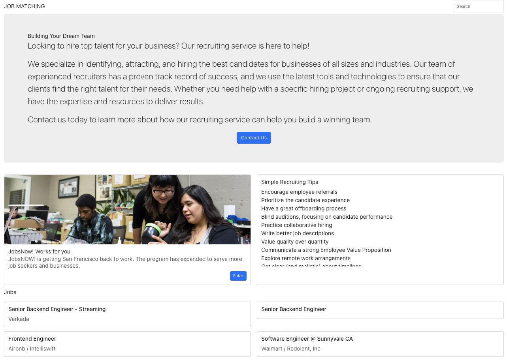

Job Matching is a platform that connect candidates and companies to find their matching partner.

[📹 Job Matching Attendance AI Video Demo](./assets/jm-5068_1750828529.mp4)

Related projects:

- [TSO Smart Resume](https://github.com/tso-techedge/yeoso-hr)

### Restaurant AI (2023, deprecated)

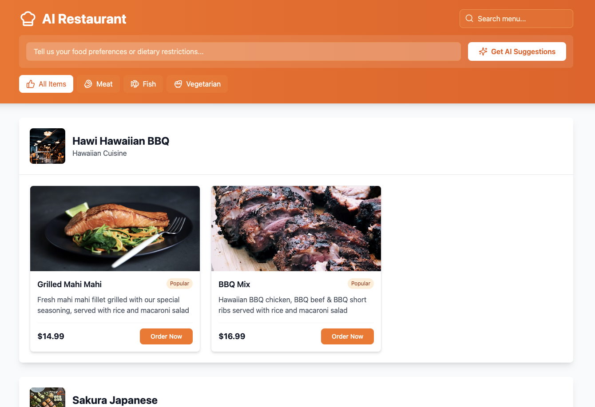

Restaurant AI is a AI assistant that helps restaurants to prompt their menu and order process.

## Historical Projects

Other historical projects

### TSO Cell Mesusrement AI (2025.06)

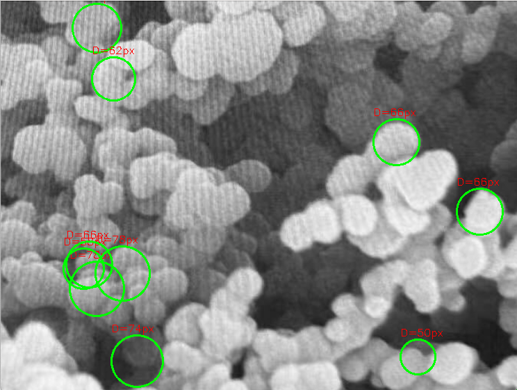

TSO Cell Mesusrement AI is a image AI tool that helps biologists to measure the cell size and finding potential disease or medichine development.

### Intelligenic (2024.06)

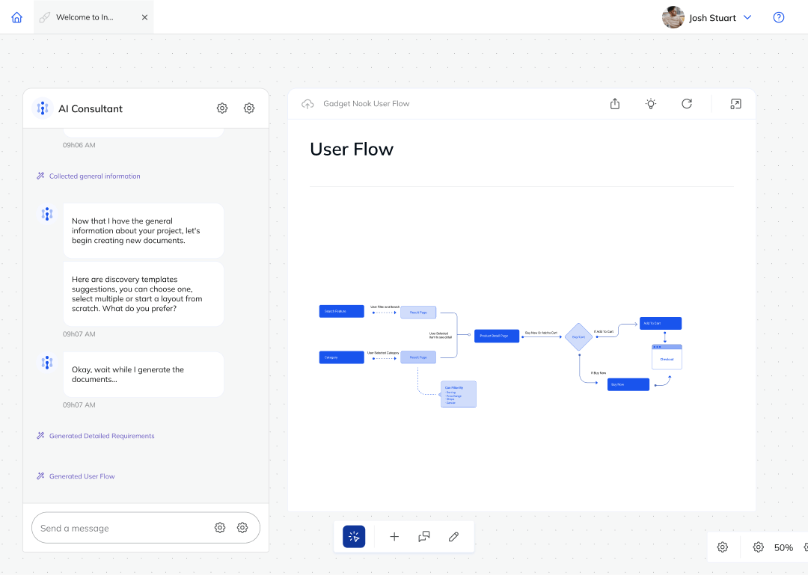

Accelerate development and increase team productivity with Intelligenic's software product lifecycle platform. AI-based prescriptive guidance and end-to-end orchestration automates discovery, design, coding, QA testing and deployment turning product managers into product heroes.

Product Demo:

- [Intelligenic Demo](https://www.youtube.com/watch?v=vQlxvOzU_0g)

### NAP (2024.06)

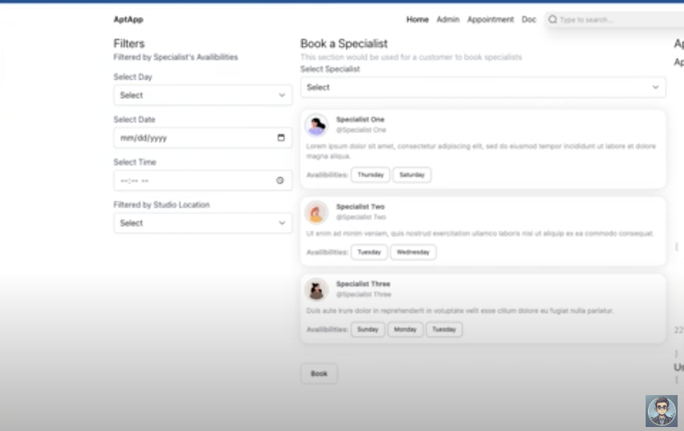

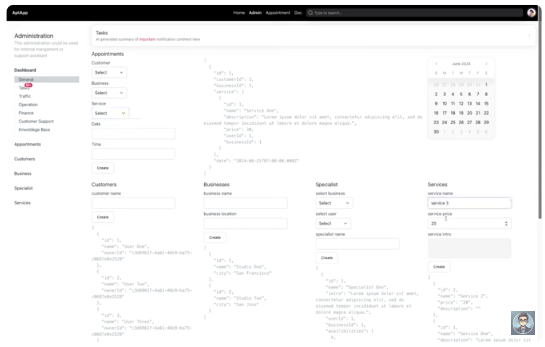

NAP is an app that help uses to access beauty services eg nail salon, massage, spa, etc.

Product Demo:

- [NAP Demo](https://www.youtube.com/watch?v=RLz4HH3TuLs&list=PLCAd5YMeHG4CKDxrWWW_yE7bVgx6BbQNA&index=1)

### AI SEO (2024.05)

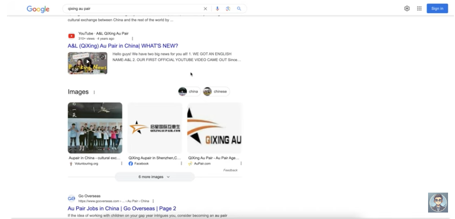

AI SEO is a AI assistant SEO strategies practice that helps clients to address their marketing need.

Product Demo:

- [Qixing Au Pair AI SEO Result](https://www.youtube.com/watch?v=PhiMPZlI_WI)

### TradinAI (2023.08, deprecated)

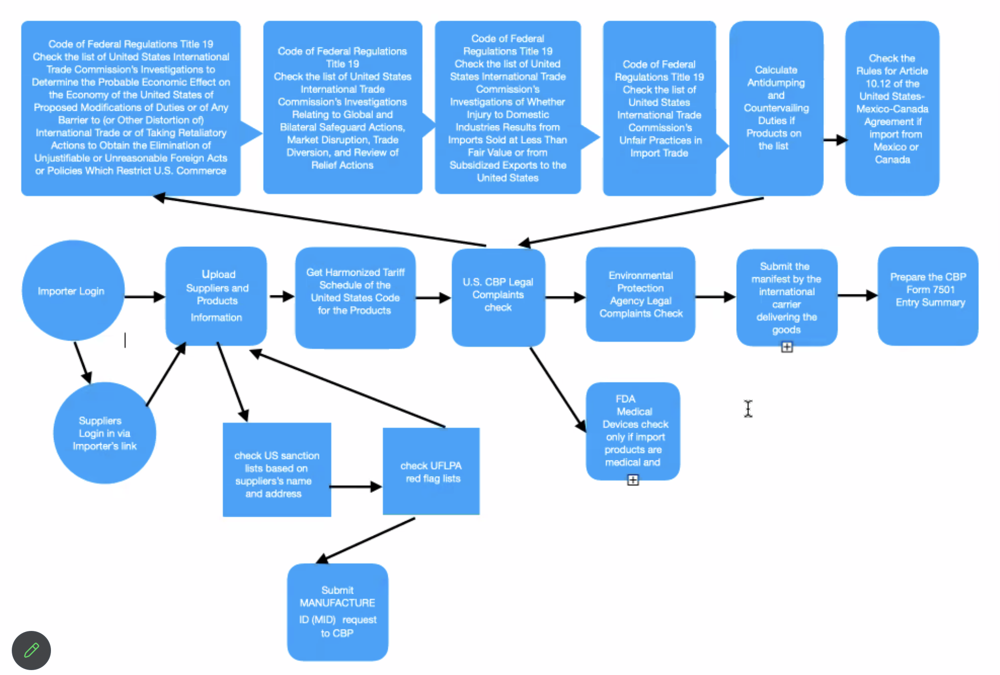

TradinAI is a AI assistant that helps users to address their international custom trading questions and prepare their customs declarations.

### Intuit Assistant (2023.01)

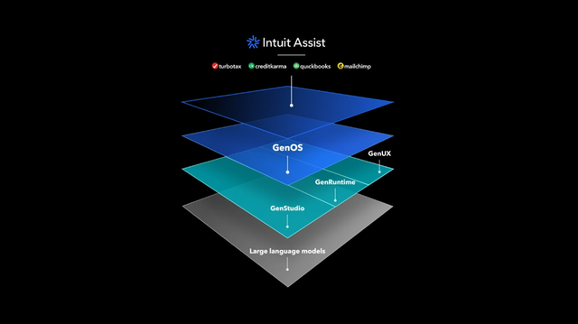

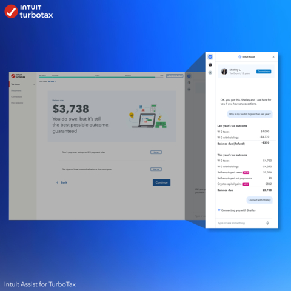

Intuit Assistant is a AI assistant that helps users to address their tax questions and prepare their tax returns within Intuit ecosystem.

### Mobile Social Media Platform (2021)

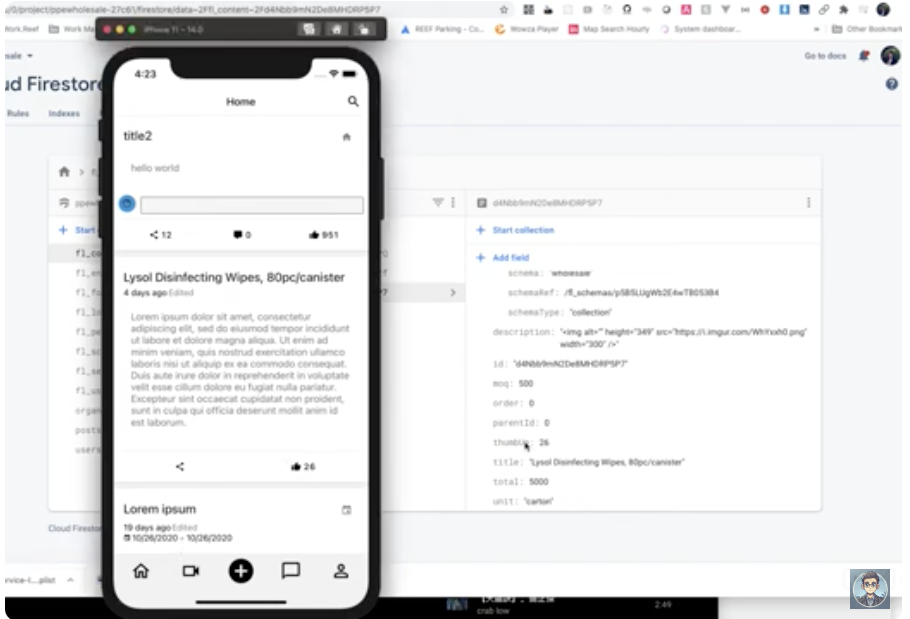

Mobile Social Media Platform is a mobile social media platform that allows users to share their lives with their friends and family.

Product Demo:

- [Mobile Social Media Platform Demo](https://www.youtube.com/watch?v=eEWNid4Pa5w)

### Security Control Center (2019)

Security Control Center is a tool that helps parking lot operators to manage their security.

## Sequencer (2018)

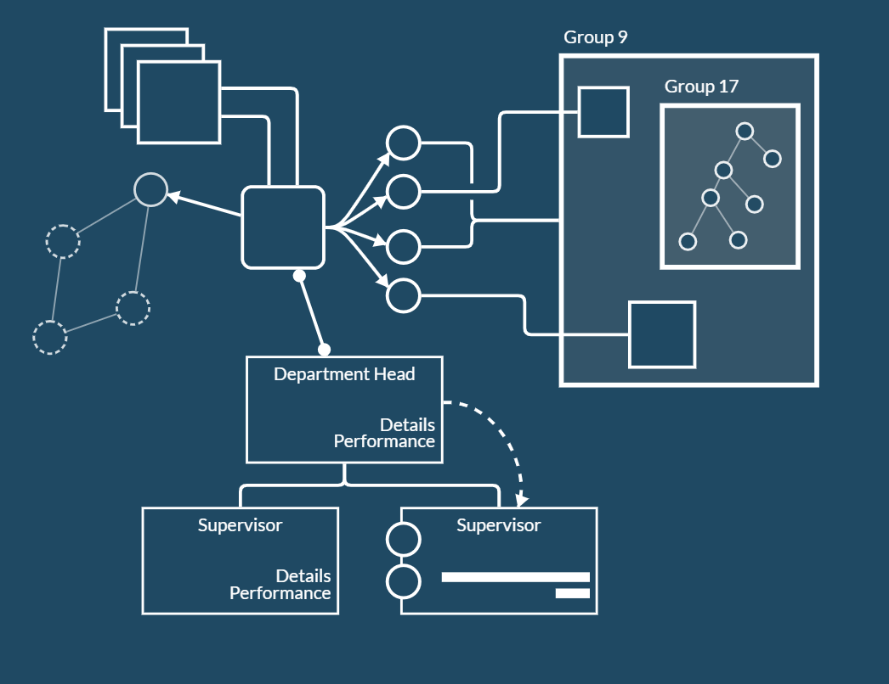

Sequencer is a tool that helps users to generate the workflow of a task with multiple AI models.

Similar projects:

- [Flowise](https://flowise.ai/)
- [LangGraph](https://langchain.com/docs/integrations/langgraph)
- [Langflow](https://www.langflow.org/)
- [CrewAI](https://crew.ai/)

Product:

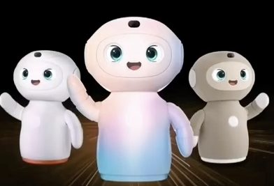

- [Huawei Xiaoyi Human Robot for Kids Education](https://www.youtube.com/watch?v=WkRzamF1bcM)

## Audio Labeling (2017)

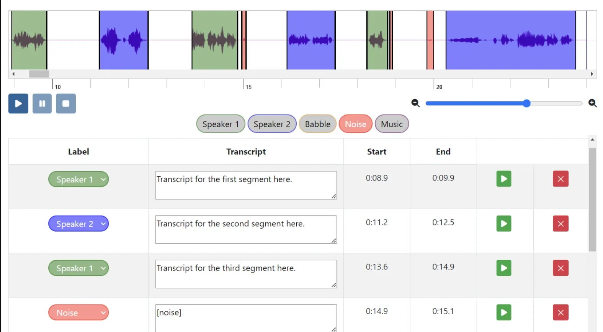

Audio annotation tool for SR (Automatic Speech
Recognition) Al/ML
(Artificial intelligence/Machine learning) project that integrates with Chatbot, Speech
Recognition, Hate Speech Detection, Music Copyrights and AI
Speaker IoT device.
